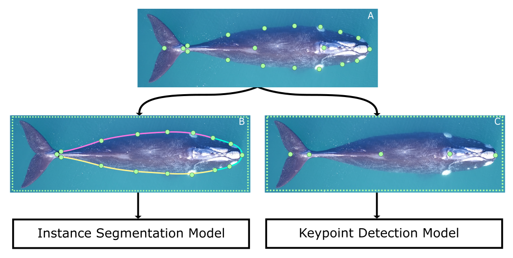

# Save the Whales

## Overview

Aerial photogrammetry is a popular non-invasive method for measuring marine mammal body size, body morphometrics, and body condition [1, 2], but processing large datasets efficiently remains challenging. We developed a machine learning algorithm using Mask-RCNN models [3] to automatically measure body morphometrics of southern right whales from aerial photographs. The algorithm produces accurate estimates of body length and volume and accurately captures temporal trends in body condition when applied to seasonal changes in body whale condition [4].

## Model Training

We create a dataset of 468 images containing 638 whales to train our models by marking 19 points on each whale. Two models are trained using this data:

1. The points outlining the whale are used to fit three cubic splines, which are then combined to generate the input masks for the instance segmentation model. The instance segmentation model is a Mask-RCNN  model [3] trained using the Detectron2 library.
2. The points along the axis of the whale are used as input to the keypoint detection model. This model is also a Mask-RCNN model used specifically for keypoint detection.

There are 3 scripts present in this repo for training the models:

1. ``Create Segmentation Masks June 2023.ipynb``: This script is used to create the segmentation mask. I have already run this script and the result is stored under ``data/final_segmentation_masks_28_july_2023_10_percent_increased_distance.pkl``.
2. ``training_segmentation_mask.py``: Used to train the instance segmentation model. Usage: ``training_segmentation_mask.py --lr <LEARNING RATE> --batch_size <BATCH SIZE>``.
3. ``training_keypoint_detection.py``: Used to train the keypoint detection model. Usage: ``training_keypoint_detection.py --lr <LEARNING RATE> --batch_size <BATCH SIZE>``

The best learning rate and batch size for both the models according to my hyperparameter tuning experiments are ``0.00225`` and ``2``, respectively. The mAP values for both the models on the test set are as follows:

| Mask R-CNN model         | Box mAP[0.5:0.95] (↑) | Keypoint mAP[0.5:0.95] (↑) | Seg. mAP[0.5:0.95] (↑) |
|--------------------------|------------|------------------|-------------|
| keypoint                 | 72.49      | 96.19            | -            |
| segmentation             | 77.41      | -                | 77.41       |

For more information, please refer to our paper [4].

##  Using the model to run inference on new images

 

Inference on new images work by passing the image through the segmentation and the keypoint detection models. The following steps are followed to get the final output:

1. The instance segmentation model produces a unique mask for each whale.
2. The keypoint detection model identifies keypoints along the whale's axis, and a polynomial curve is fitted through these points to estimate the axis.
3. The outputs from the instance segmentation and keypoint detection models are combined to get the whale’s width at 5% intervals along its axis.

Inference is performed using the Google Colab platform.

Please follow the steps indicated in [Google Colab User Guide](https://docs.google.com/document/d/1Yp4yD7NGfHaZEL4DK3kzPJ2NvI89Duiy/edit) (also present as a PDF file in the ``inference`` folder) to run the notebook on Google Colab.

[``Whales_Inference_Module.ipynb``](https://drive.google.com/file/d/1_5urD8bAHAMsjnNn7gv8NS9XPINoJy25/view?usp=sharing) is the Jupyter notebook used to perform inference for new whale images.

Model weights: [Detectron2_Models.zip](https://drive.google.com/file/d/10zFCacIIp-N0NjwuOfhb_RIdCw_Fs_v3/view?usp=drive_link)

## Postprocessing

Please follow the ``Postprocessing guidelines.pdf`` file in the ``postprocessing`` folder to correct the points predicted by our model.

## References

1. Christiansen, F., Dujon, A.M., Sprogis, K.R., Arnould, J.P. and Bejder, L., 2016. Noninvasive unmanned aerial vehicle provides estimates of the energetic cost of reproduction in humpback whales. Ecosphere, 7(10), p.e01468.

2. Christiansen, F., Sironi, M., Moore, M.J., Di Martino, M., Ricciardi, M., Warick, H.A., Irschick, D.J., Gutierrez, R. and Uhart, M.M., 2019. Estimating body mass of free‐living whales using aerial photogrammetry and 3D volumetrics. Methods in Ecology and Evolution, 10(12), pp.2034-2044.

3. He, K., Gkioxari, G., Dollár, P. and Girshick, R., 2017. Mask r-cnn. In Proceedings of the IEEE international conference on computer vision (pp. 2961-2969).

4. Bagchi, C., Medina, J., Irschick, D.J., Maji, S., and Christiansen, F., 2025. Automated extraction of right whale morphometric data from drone aerial photographs. Remote Sensing in Ecology and Conservation.